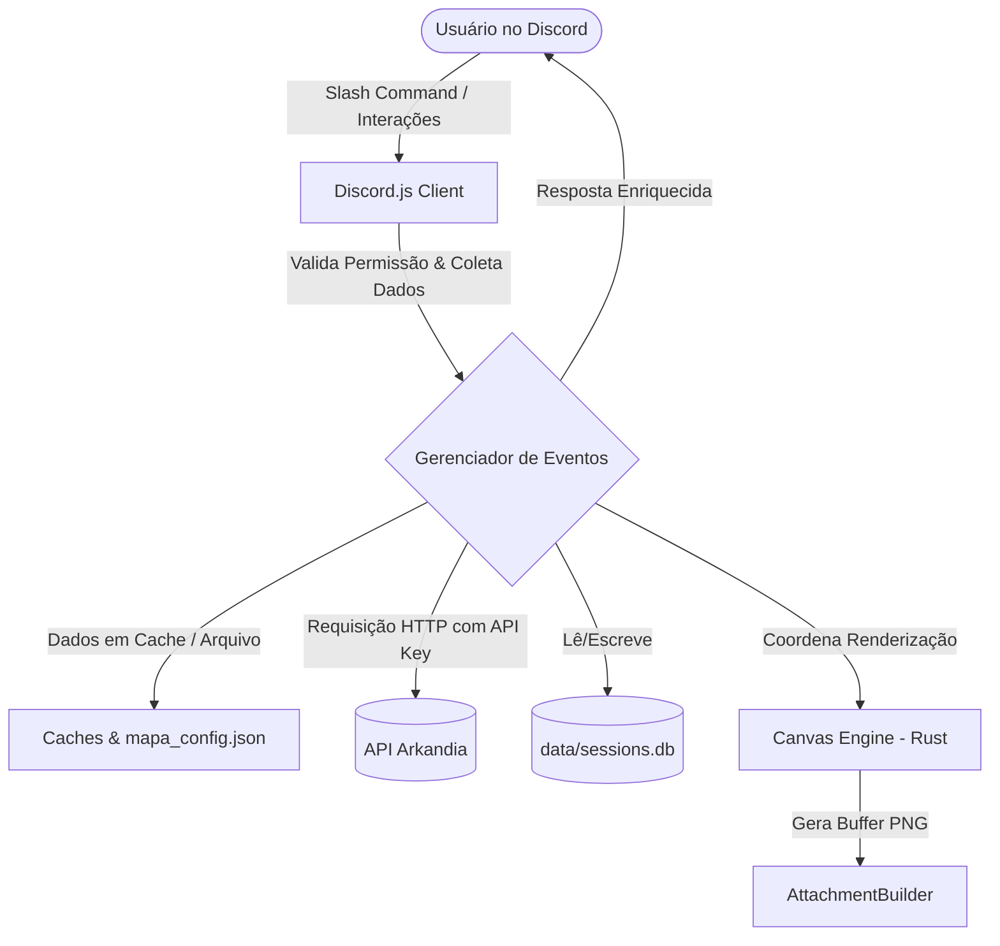

# Arkandia RPG Bot — Documentação de Desenvolvimento (Dev-Doc)

Esta documentação foi elaborada especificamente para **Desenvolvedores** e **Agentes de IA** compreenderem com precisão a arquitetura, o fluxo de dados e os padrões de design do bot de RPG no Discord integrado à API de Arkandia.

---

## Stack Tecnológica e Dependências

O bot é construído utilizando a seguinte base tecnológica:

| Tecnologia | Finalidade | Detalhes / Versão |
| :--- | :--- | :--- |
| **Node.js** | Ambiente de execução | v18 ou superior (testado em v20) |
| **Discord.js** | Comunicação com a API do Discord | `^14.26.4` (Slash Commands, Webhooks, Components, Modals) |
| **@napi-rs/canvas** | Renderização 2D acelerada das HUDs | `^1.0.0` (Performance nativa em Rust) |
| **better-sqlite3** | Persistência local (sessões RP/Cena e localidades) | `^11.0.0` (sync, sem dependência externa) |
| **Axios** | Cliente HTTP para integração externa | `^1.16.0` (Requisições à API de Arkandia) |
| **dotenv** | Gerenciamento de variáveis de ambiente | `^17.4.2` |

> **Fontes padronizadas** (registradas via `GlobalFonts` em `utils/fonts.js`):
> - **Cinzel** (header/display) — títulos, banners, números grandes.
> - **Nunito** (body) — textos, parágrafos, descrições.
> - **Baloo 2** (UI) — menus, chrome, labels, números, botões.
>
> Os arquivos `.ttf` ficam em `assets/fonts/`. Para fontes ausentes ou caracteres não cobertos, o canvas faz fallback automático, mas a hierarquia acima deve ser respeitada nas renderizações.

---

## Arquitetura do Sistema e Fluxo de Dados

O bot opera sob um modelo reativo orientado a eventos do Discord (`interactionCreate` e `messageCreate`). Ele consome dados em tempo real da API de Arkandia e mantém um estado em memória cache para sessões ativas e VTT, com persistência local em SQLite para sessões de RP/Cena e configurações de localidade.



### Padrão Atual de HUDs do Jogador
As HUDs abertas pelo `/painel` seguem um roteamento de mensagem única:
- A tela inicial exibe o menu completo do jogador.
- Ao entrar em uma sub-HUD, o bot reduz os componentes para `Inicio` + controles locais daquela tela.
- Inventário, ranking, perfil, enciclopédia e detalhes internos atualizam a mesma mensagem via `editReply` ou `update`.
- Modais de busca, como o da `/enciclopedia`, devem substituir a HUD original em vez de publicar uma nova resposta visual.

---

## Persistência Local (SQLite)

Banco: `data/sessions.db` (criado automaticamente, WAL mode). Ignorado pelo `.gitignore` (cada ambiente gera o seu).

### Tabelas
- `sessions`: sessões de RP (e cenas filhas) — id, type (`rp`/`cena`), status (`ativa`/`encerrada`/`abandonada`), `parent_session_id`, `discord_thread_id`, `discord_channel_id`, `discord_guild_id`, title, subtitle, ambiance, scenario_url, creator, finished_at/by, message_count, created_at.
- `session_participants`: participantes (session_id + discord_id + display_name).
- `session_messages`: cada mensagem de texto gravada (id, session_id, discord_message_id, author_discord_id, author_name, content, sent_at).
- `localities`: configuração de canais de localidade (discord_channel_id PK, discord_guild_id, title, description, image_url, updated_at, updated_by, panel_message_id).

### Módulo
- `utils/sessionStore.js` — expõe `init`, `createSession`, `addMessage`, `addParticipant`, `finishSession`, `getSession`, `getSessionParticipants`, `findActiveSessionByChannel`, `findActiveRpSessionByChannel`, `listChildSessions`, `findSessionsByPrefix`, `listSessions`, `countSessions`, `getSessionHistory`, `canFinishSession`, `canViewHistory`, `upsertLocality`, `getLocality`, `setLocalityPanelMessageId`.
- O `init()` deve ser chamado antes de qualquer operação (já é chamado em `index.js` no `ready`).
- O banco é criado na primeira execução com `CREATE TABLE IF NOT EXISTS`. Migrações idempotentes (ex.: adicionar coluna) usam `ALTER TABLE` em `try/catch`.

---

## Estruturas de Estado e Caches Locais

Por simplicidade e velocidade de acesso em canais de texto de RPG, parte do estado operacional do bot é mantido em memória:

### 1. Sistema de Cache Global (`catalogCache` e `renderQueue`)
- **`catalogCache`**: carrega e atualiza periodicamente em background os catálogos de `/itens`, `/skills`, `/bestiario` e `/npcs`. Comandos como `/catalogo`, `/bestiario` e `/enciclopedia` consultam esta RAM.
- **`renderQueue`**: fila (Queue) que gerencia a renderização Canvas no `@napi-rs/canvas` (no máximo 3 imagens simultâneas).

### 2. Mapa de Configuração (`mapaConfig` e `mapa_config.json`)
Array de IDs das categorias do Discord que representam regiões de RPG válidas no servidor. Sincronizado em `mapa_config.json`.

### 3. Cenas Ativas (`cenasAtivas` — `Map`)
Chaveado por `channelId` contendo o estado da cena tática (VTT). Veja o type `CenaVTT` com `players`, `estado`, `rodada`, `turnoAtual`, `msgId`, `tempoTurnoMs`, etc.

### 4. Cache de Grimórios (`skillsCache` — `Map`)
Chaveado por `message.id` da resposta ao comando `/skills`.

### 5. Missões em Preparação (`missoesPreparacao` — `Map`)
Chaveado por `message.id` da convocação (`/missao preparar`), rastreia o "Ready Check" de cada membro.

### 6. Drafts de Arena Ativos (`arenasDraft` — `Map`)
Chaveado por `message.id` do painel de picks/bans.

### 7. Timers de Auto-Skip (`timersTurno` — `Map`)
Chaveado por `message.id` do mapa ativo, armazena timeouts (`NodeJS.Timeout`) ativos do auto-skip.

### 8. Mestres Interpretando (`mestresNarrando` — `Map`)
Chaveado por `${channelId}-${userId}`. Armazena nome e avatar do NPC que o Mestre está emulando. A mensagem é deletada e reenviada via webhook.

### 9. Controle de Coleta de Loot (`lootsEmProcessamento`, `lootsColetados` — `Set`)
Garantem integridade transacional na coleta de recompensas (botão do `/mestre dropar`).

### 10. Roteador Dinâmico e Modularização (`commands/` e Autoloader)
O `index.js` importa dinamicamente cada comando de `commands/` via `client.commands.set(...)`. Interações são despachadas por prefixo de `customId`:
- `execute(interaction)` — Slash Commands.
- `handleButton(interaction)` — cliques em botões.
- `handleSelect(interaction)` — seleções em menus.
- `handleModal(interaction)` — submissões de modais.

---

## Sistema de Gravação de Sessões de RP/Cena

Cada mensagem de texto enviada em um thread com sessão ativa (RP ou cena filha) é gravada automaticamente no banco (`session_messages`) pelo listener `messageCreate` do `index.js`. A sessão é encerrada manualmente (botão "Encerrar sessão" ou `/rp encerrar`), e nesse momento:
- Status da sessão (e de todas as cenas filhas) vai para `encerrada`.
- `finished_at` e `finished_by` são preenchidos.
- No caso do RP, o thread é deletado pelo bot.

### Comandos de consulta
- **`/sessao listar`** (mestre/admin) — embed com as sessões do servidor, com filtros por status e criador.
- **`/sessao historico id:`** — exporta transcrição `.txt` (sem emojis, com cabeçalho formatado). Aceita o UUID **completo** ou um **prefixo de 4+ caracteres** (busca `LIKE` com escape de wildcards, escopada ao servidor atual). Se o prefixo for ambíguo, lista os matches.

### Permissões de consulta (`canViewHistory`)
- Administrator e ManageMessages veem qualquer sessão.
- Participantes registrados veem apenas suas próprias sessões.

---

## Localidades (Regiões de RP fixas)

Categorias do Discord representam regiões; canais de texto sob elas são **localidades** (fixos, com jogadores impedidos de enviar mensagens pelo permissionamento do canal).

### Comandos
- **`/localidade configurar`** (mestre/admin) — publica o **card da localidade** (banner único em canvas, com a imagem de referência como background, título e descrição) como o bot do Discord e fixa. Salva a configuração no banco. Opcionalmente seguido de `/localidade painel`.
- **`/localidade painel`** (mestre/admin) — publica o **painel de ações** com dois botões fixos:
  - **Iniciar RP** — instrui o usuário a usar `/rp iniciar` neste canal. A mensagem do painel é deletada automaticamente para manter o canal limpo.
  - **Explorar** — resposta ephemeral: "mecânica em desenvolvimento".

### Permissões do canal
- O canal deve estar configurado com `Send Messages: false` para `@everyone`.
- O bot precisa de `Create Public Threads`, `Manage Messages` (para fixar) e `Manage Webhooks` (se usar).
- O tópico criado pelo RP recebe automaticamente `SendMessages: true` para `@everyone` (aplicado pelo `rpScene`), permitindo que os jogadores conversem no tópico mesmo com o canal-pai read-only.

### Limpeza automática do canal
- Notificações de pin do Discord (`message.type === 7`, "X fixou uma mensagem") são **deletadas automaticamente** pelo listener `messageCreate` em `index.js`.
- Mensagens de feedback efêmeras (`interaction.editReply`) já não persistem.
- Mensagens de instrução dentro do tópico (ex.: "A sessão foi iniciada...") são deletadas após 15s via `utils/tempMessage.deleteAfterDelay`.

---

## Banner Unificado do RP e Canvas Dinâmico

`/rp iniciar` (e o botão de iniciar RP no painel) usa `utils/rpScene.iniciarCenaRp`, que:
1. Renderiza **uma única imagem** com `canvas/renderer.js → gerarBannerRpUnificado` (cenário como background; título, subtítulo, ambientação, participantes e crédito empilhados verticalmente; seções opcionais só aparecem quando preenchidas).
2. Cria a thread, ajusta permissões para permitir mensagens, apaga o painel da localidade (se aplicável) e envia o banner via `thread.send` como o bot (sem webhook Narrador para os banners).
3. Persiste a sessão no banco e envia a mensagem do botão de encerramento (com `deleteAfterDelay(15000)`).

### Canvas dinâmico
Ambos os banners (`gerarBannerLocalidade` e `gerarBannerRpUnificado`) ajustam a altura do canvas de saída à proporção da imagem enviada:
- Largura fixa: 1000px (para evitar re-escala pelo Discord).
- Altura: `h = max(altura_referência, min(max, round(1000 * aspect))`).
- Localidade: H_REF=620, max=1200.
- RP: H_REF=780, max=1500.
- Texto, fontes e molduras escalam proporcionalmente via `ctx.scale(1, s)`.

### Bug fix do `loadImage`
`loadImage` (em `canvas/renderer.js`) retorna um canvas 1x1 transparente quando o download falha. Os banners tratam isso como falha: se `bgImage.width <= 16 || bgImage.height <= 16`, usam o `drawHudBase` (fundo cinza do HUD com painel medieval) em vez de renderizar a imagem inválida.

---

## VTT, Arena e Mapa

### `/cena`
Subcomandos principais: `iniciar`, `entrar`, `mover`, `npc_entrar`, `fechar`, `combate_iniciar`, `combate_proximo`, `mover_livre`, `status_vida`, `encerrar`. Regras: mapa 3x3 a 14x12, sem colisão de tokens, timer opcional com auto-skip.

### `/arena`
- `iniciar`: abre picks/bans.
- `encerrar`: finaliza a arena no canal.

### `/mapa`
Categorias regionais e viagens.

---

## Comandos Slash Adicionais

- **`/rp iniciar`** — cria cena de RP (banner unificado + thread + sessão no banco). Aceita titulo, participantes, subtitulo, ambientação, cenário (imagem).
- **`/rp encerrar`** — encerra a sessão de RP ativa no tópico e deleta o tópico.
- **`/sessao listar` / `/sessao historico id:`** — consulta e exporta sessões de RP/Cena.
- **`/localidade configurar` / `/localidade painel`** — configura canal de localidade e publica painel fixo.

---

## Integração Arkandia API (v1)

Todas as requisições para `https://www.ernas.com.br/api/public/v1` exigem o header `X-API-Key`.

> **Headers Obrigatórios:**
> - `X-API-Key`: a chave secreta obtida no painel de desenvolvedor.
> - `Idempotency-Key` (apenas para POSTs): UUID v4 gerado pelo bot para evitar execuções duplicadas.

### Pontos de Consumo
1. **Resolução de Personagens:** `GET /personagens/discord/:id`.
2. **Itens e Drops:** `/itens/:ref` suporta UUID, slug e nome.
3. **NPCs, Bestiário e Enciclopédia:** `/npcs/:ref` e fallback `/bestiario/:ref`.
4. **Inserção no Inventário:** `POST /personagens/:id/inventario/adicionar` com `Idempotency-Key`.

---

## Armadilhas Comuns e Regras Importantes (Gotchas)

> **Renderização Canvas:**
> - Sempre use as fontes registradas via `utils/fonts.js` (Cinzel/Nunito/Baloo 2). Não use `sans-serif`/`serif` cru (são fontes do sistema e podem não ter glifos para caracteres acentuados/especiais).
> - Para imagens de URL, use sempre o `loadImage` seguro (valida hostnames confiáveis: `cdn.discordapp.com`, `media.discordapp.net`, `www.ernas.com.br`, `*.supabase.co`, `*.imgur.com`). URLs de outros hosts são rejeitadas por segurança (SSRF).
> - Limite de download: 8MB e timeout de 8s. Se o `loadImage` falhar, ele retorna um canvas 1x1 — sempre cheque `bgImage.width > 16` antes de usar.

> **Webhooks:**
> - O sistema de mestres interpretando (`/narrar`) usa webhooks para re-enviar mensagens com identidade customizada.
> - Os **banners de cena/localidade** não usam mais webhook — são enviados diretamente pelo bot.
> - O bot pode não ter permissão de `ManageWebhooks` em todos os canais. Sempre use `try/catch` ao criar webhooks.

> **Botão "Encerrar sessão":**
> - Está implementado como botão Discord (customId `encerrar_sessao_<id>`) e também como comando `/rp encerrar`. Ambos podem encerrar (criador da sessão ou Administrator).
> - No caso do RP, ao encerrar, o thread é deletado. Cenas filhas também são marcadas como encerradas automaticamente.
> - Para cenas (`/cena encerrar`), o botão do painel da cena não deleta o thread (compartilhado com o RP pai), mas limpa `cenasAtivas` e timers.

> **Build Skills vs Skills Adquiridas:**
> O array `skills_adquiridas` é o acervo total aprendido. Para exibir apenas o grimório **equipado**, use `build_skills`. O `/skills` mapeia `skills_adquiridas` por padrão.

> **Prefix Lookup em `/sessao historico`:**
> Aceita prefixo de 4+ caracteres do UUID. Sanitiza caracteres não-hexadecimais e escapa wildcards SQL (`%`, `_`, `\`). Escopado ao servidor atual. Se o prefixo for ambíguo, retorna a lista de matches.

> **Localidade — permissionamento do canal:**
> O canal de localidade deve ter `SendMessages: false` para `@everyone`. O bot aplica `SendMessages: true` automaticamente no thread criado pelo RP, para que os jogadores possam conversar dentro do tópico mesmo com o canal-pai read-only.

---

## Estrutura de Pastas

```
bot-ernas/
├── index.js                      # Cliente Discord + autoloader de comandos
├── canvas/
│   └── renderer.js               # Engine Canvas (todas as HUDs/banners)
├── commands/                      # Slash commands (um arquivo por comando)
│   ├── painel.js
│   ├── perfil.js
│   ├── rp.js                     # /rp iniciar, /rp encerrar
│   ├── sessao.js                 # /sessao listar, /sessao historico
│   ├── localidade.js             # /localidade configurar, /localidade painel
│   └── ...
├── utils/
│   ├── sessionStore.js           # SQLite (sessoes RP/Cena + localidades)
│   ├── rpScene.js                # Lógica compartilhada de criação de cena de RP
│   ├── tempMessage.js            # deleteAfterDelay (canais sempre limpos)
│   ├── fonts.js                  # Registro GlobalFonts (Cinzel/Nunito/Baloo 2)
│   ├── state.js                  # Maps de estado em memória
│   ├── sceneCleanup.js           # Limpeza periódica de cenas abandonadas
│   ├── helpers.js                # formatarTexto, embedErro, embedSucesso, etc.
│   └── profileCache.js
├── assets/
│   ├── fonts/                    # Cinzel, Nunito, Baloo 2 (TTF)
│   ├── ui/painel-hud-medieval.png
│   └── ...
├── data/                         # SQLite (ignorado pelo .gitignore)
├── .github/workflows/deploy.yml  # Deploy automático
└── docs e guias (DEPLOY_GUIDE, COMMANDS_AND_FEATURES, HUD_VISUAL_STANDARD, DEV_DOCUMENTATION)
```
