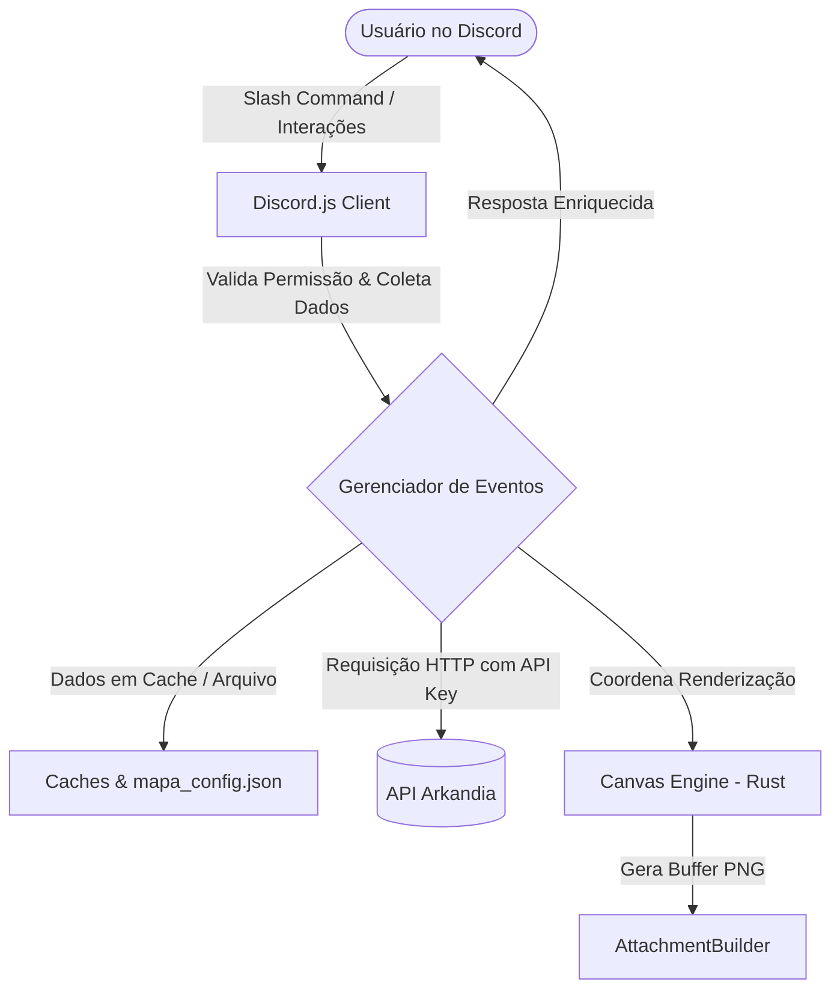

# 📖 Arkandia RPG Bot — Documentação de Desenvolvimento (Dev-Doc)

Esta documentação foi elaborada especificamente para **Desenvolvedores** e **Agentes de IA** compreenderem com precisão a arquitetura, o fluxo de dados e os padrões de design do bot de RPG no Discord integrado à API de Arkandia.

---

## 🛠️ Stack Tecnológica & Dependências

O bot é construído utilizando a seguinte base tecnológica:

| Tecnologia | Finalidade | Detalhes / Versão |
| :--- | :--- | :--- |
| **Node.js** | Ambiente de execução | Recomenda-se v18 ou superior |
| **Discord.js** | Comunicação com a API do Discord | `^14.26.4` (Slash Commands, Webhooks, Components) |
| **@napi-rs/canvas** | Renderização 2D acelerada do VTT | `^1.0.0` (Performance nativa em Rust) |
| **Axios** | Cliente HTTP para integração externa | `^1.16.0` (Requisições à API de Arkandia) |
| **dotenv** | Gerenciamento de variáveis de ambiente | `^17.4.2` |

---

## 🏗️ Arquitetura do Sistema & Fluxo de Dados

O bot opera sob um modelo reativo orientado a eventos do Discord (`interactionCreate`). Ele consome dados em tempo real da API de Arkandia e mantém um estado em memória cache para sessões ativas e VTT. Na nova arquitetura, o bot também faz pré-carregamento de dados (Preload) via `catalogCache` para diminuir a latência de consultas estáticas (itens, skills e bestiário).



---

## 💾 Estruturas de Estado e Caches Locais

Por simplicidade e velocidade de acesso em canais de texto de RPG, parte do estado operacional do bot é mantido em memória, com persistência mínima em arquivos locais:

### 1. Sistema de Cache Global (`catalogCache` & `renderQueue`)
Para garantir máxima performance durante a alta demanda (múltiplos jogadores consultando itens ou renderizando canvas), o bot implementa duas esteiras de otimização:
*   **`catalogCache`**: Carrega e atualiza periodicamente em background os catálogos de `/itens`, `/skills`, `/bestiario` e `/npcs` vindos da API. Os comandos `/catalogo`, `/bestiario` e `/enciclopedia` consultam esta memória Ram, poupando a API do site e respondendo instantaneamente.
*   **`renderQueue`**: Uma fila (Queue) especializada em gerenciar a renderização Canvas no `@napi-rs/canvas`. Evita que requisições assíncronas concorrentes engasguem a single-thread do Node.js, processando no máximo 5 imagens simultâneas.

### 2. Mapa de Configuração (`mapaConfig` & `mapa_config.json`)
Armazena um array de IDs das categorias do Discord que representam regiões de RPG válidas no servidor para controle de viagem rápida.
*   **Persistência:** Sincronizado automaticamente no arquivo `mapa_config.json` via `fs.writeFileSync`.

### 2. Cenas Ativas (`cenasAtivas` - `Map`)
Dicionário chaveado por `channelId` (ID do canal de texto onde o mapa foi aberto) contendo o estado da cena tática (VTT):
```typescript
interface PlayerToken {
    discordId: string; // "npc_timestamp" para NPCs
    name: string;      // Nome visível no token
    avatarUrl: string; // URL da imagem para o retrato
    x: number;         // Posição horizontal indexada em 0
    y: number;         // Posição vertical indexada em 0
    isNpc: boolean;    // Flag para distinção de borda
    incapacitado: boolean; // Flag de status de vida (morto/caído)
}

interface CenaVTT {
    linhas: number;       // Altura em células
    colunas: number;     // Largura em células
    fundoUrl: string | null; // URL da imagem de fundo do grid
    estado: 'ABERTA' | 'FECHADA' | 'COMBATE';
    rodada: number;
    turnoAtual: number;  // Índice do array de players
    players: PlayerToken[];
    msgId: string | null; // ID da mensagem contendo a imagem do mapa ativa
}
```

### 3. Cache de Grimórios (`skillsCache` - `Map`)
Chaveado por `message.id` (ID da mensagem de resposta ao comando `/skills`). Evita múltiplas chamadas à API quando o usuário interage várias vezes com o menu de seleção da mesma mensagem de grimório.

### 4. Missões em Preparação (`missoesPreparacao` - `Map`)
Chaveado por `message.id` da mensagem de convocação (`/missao preparar`), rastreia o estado da confirmação ("Ready Check") de cada membro inscrito:
```typescript
interface MissaoPreparacao {
    msgId: string;
    nome: string;
    jogadores: Array<{
        id: string; // Discord ID
        nomePersonagem: string;
        pronto: boolean;
    }>;
    channelId: string;
}
```

### 5. Drafts de Arena Ativos (`arenasDraft` - `Map`)
Chaveado por `message.id` (ID da mensagem do painel de picks e bans), rastreia os dados do draft em andamento de uma arena:
```typescript
interface ArenaDraft {
    capitaes: string[]; // Array com 2 Discord IDs dos capitães
    turnoCapitao: number; // Índice de quem está banindo (0 ou 1)
    mapasRestantes: MapaArena[]; // Mapas disponíveis para banir
    tempoTurnoMs: number; // Tempo de turno configurado em milissegundos
}
```

### 6. Timers de Auto-Skip (`timersTurno` - `Map`)
Chaveado por `message.id` (ID da mensagem do mapa ativo), armazena a referência aos timeouts (`NodeJS.Timeout`) ativos do auto-skip do turno do combate da arena. Sempre que o combate de uma arena é encerrado ou o turno é passado manualmente/automaticamente, o timer correspondente é cancelado com `clearTimeout` e excluído deste Map para evitar vazamentos de memória ou transições indesejadas.

### 7. Mestres Interpretando (`mestresNarrando` - `Map`)
Chaveado pela string combinada `${channelId}-${userId}`, este Map armazena os dados de identidade (nome e URL de avatar) que o Mestre está emulando ativamente naquele canal. Se uma entrada existir para o autor da mensagem no canal em questão, a mensagem de texto padrão é deletada e re-enviada via Webhook sob a identidade guardada em tempo real.

### 8. Controle de Coleta de Loot (`lootsEmProcessamento` & `lootsColetados` - `Set`)
Utilizados para garantir integridade transacional na coleta de recompensas (botão do comando `/mestre dropar`):
*   `lootsEmProcessamento`: Conjunto de `message.id` das coletas de item cujo processo da API (resolução + inserção POST) está em andamento. Bloqueia cliques concorrentes ou duplicados de forma imediata.
*   `lootsColetados`: Conjunto de `message.id` das mensagens de loot que já foram totalmente coletadas por algum jogador. Previne que itens sejam resgatados mais de uma vez.

### 9. Roteador Dinâmico e Modularização (`commands/` e Autoloader)
Todo o controle do bot agora reside em um Autoloader ágil e robusto no `index.js` (~120 linhas). O bot importa dinamicamente cada comando da pasta `commands/` usando `client.commands.set(...)`. 
As interações (`ChatInputCommand`, `Button`, `StringSelectMenu` e `ModalSubmit`) são despachadas automaticamente para os handlers dentro do próprio arquivo do comando:
- `execute(interaction)`: Lógica base para Slash Commands.
- `handleButton(interaction)`: Captura cliques em botões baseados no prefixo do comando.
- `handleSelect(interaction)`: Captura seleções de menus.
- `handleModal(interaction)`: Submissões de formulários.
Essa arquitetura isolada garante altíssima escalabilidade e facilidade de manutenção.

### Padrao Atual de HUDs do Jogador
As HUDs abertas pelo `/painel` seguem um roteamento de mensagem unica:
*   A tela inicial exibe o menu completo do jogador.
*   Ao entrar em uma sub-HUD, o bot reduz os componentes para `Inicio` + controles locais daquela tela.
*   Inventario, ranking, perfil, enciclopedia e detalhes internos atualizam a mesma mensagem via `editReply` ou `update`.
*   Modais de busca, como o da `/enciclopedia`, devem substituir a HUD original em vez de publicar uma nova resposta visual.

## 🎨 Engine de Renderização 2D (VTT)

O VTT desenha dinamicamente um mapa tático utilizando `@napi-rs/canvas`. 

### Parâmetros Físicos do Grid:
*   `CELL_SIZE`: `80` pixels por célula.
*   `MARGIN`: `30` pixels de recuo para exibição de coordenadas (letras A-Z no eixo X, números 1-N no eixo Y).
*   `Width / Height` do Canvas: Calculados com base no número de colunas/linhas, respeitando um tamanho mínimo de `400x400` pixels.

### Desenho dos Tokens:
*   Os avatares dos jogadores são carregados via `loadImage` e mascarados como círculos perfeitos (`ctx.arc(...)` + `ctx.clip()`).
*   **Código de Cores das Bordas dos Tokens:**
    *   `Cinza (#7F8C8D)`: Jogador incapacitado.
    *   `Dourado (#F1C40F)`: Turno ativo do jogador (no modo `COMBATE`).
    *   `Vermelho (#E74C3C)`: NPCs / Monstros vivos.
    *   `Azul (#3498DB)`: Jogadores vivos.
*   **Incapacitação:** Um "X" vermelho semi-transparente é renderizado sobre o token se `incapacitado: true`.

> [!TIP]
> **Otimização por Debounce:** Para evitar sobrecarga gerada por cliques rápidos de movimentação nos botões, a função `atualizarMapaDebounced` atrasa o envio de atualizações em `600ms`. Se um novo movimento ocorrer dentro deste período, o timer anterior é limpo.

---

## 📡 Integração Arkandia API (v1)

Todas as requisições para `https://www.ernas.com.br/api/public/v1` exigem o header `X-API-Key`.

> [!IMPORTANT]
> **Headers Obrigatórios:**
> - `X-API-Key`: A chave secreta obtida no painel de desenvolvedor.
> - `Idempotency-Key` (apenas para operações do tipo `POST`): Um UUID v4 exclusivo gerado pelo bot para evitar execuções duplicadas sob oscilações de rede.

### Principais Pontos de Consumo da API no Bot:
1.  **Resolução de Personagens:**
    *   O bot resolve automaticamente o personagem buscando por Discord ID (`GET /personagens/discord/:idOuUsername`).
2.  **Consulta a Itens e Drops:**
    *   `/itens/:ref` suporta UUID, slug e nome.
3.  **NPCs, Bestiário e Enciclopédia:**
    *   Para o sistema de impersonação (`/narrar habilitar` e `/cena npc_entrar`), o bot tenta carregar os dados de `/npcs/:ref` e, caso dê 404, recorre ao `/bestiario/:ref` para criaturas selvagens.
    *   O comando global `/bestiario` continua como atalho rápido para criaturas.
    *   O comando `/enciclopedia` consolida itens, habilidades, bestiário e NPCs canônicos em uma só interface com busca modal e correspondência aproximada.
4.  **Inserção no Inventário:**
    *   Ao clicar no botão de coleta de drop, o bot efetua um `POST /personagens/:id/inventario/adicionar` passando o `item_id` e a `quantidade` para popular o inventário do jogador em tempo real no site do jogo, utilizando cabeçalhos de controle e autenticação (`X-API-Key` e `Idempotency-Key` com UUID v4 gerado no ato).

---

## ⚠️ Armadilhas Comuns & Regras Importantes (Gotchas)

> [!WARNING]
> **Tratamento de Fallbacks de Webhooks:**
> Algumas funcionalidades como `/rp iniciar` e o sistema de interpretação em tempo real `/narrar` tentam criar webhooks dinâmicos no canal para enviar mensagens com avatares/nomes personalizados. 
> Sempre implemente blocos `try-catch` robustos. Caso o bot não tenha a permissão `ManageWebhooks` no servidor, a lógica deve reverter para um envio clássico do bot utilizando embeds explicativos para não quebrar a experiência do usuário.

> [!WARNING]
> **Build Skills vs Skills Adquiridas:**
> Conforme a documentação da API, o array `skills_adquiridas` representa o acervo total aprendido. Para exibir apenas o grimório atualmente **equipado**, utilize `build_skills`. Atualmente, o comando `/skills` mapeia `skills_adquiridas` para visualização, mas lembre-se desta diferença conceitual se for expandir mecânicas de batalha!
